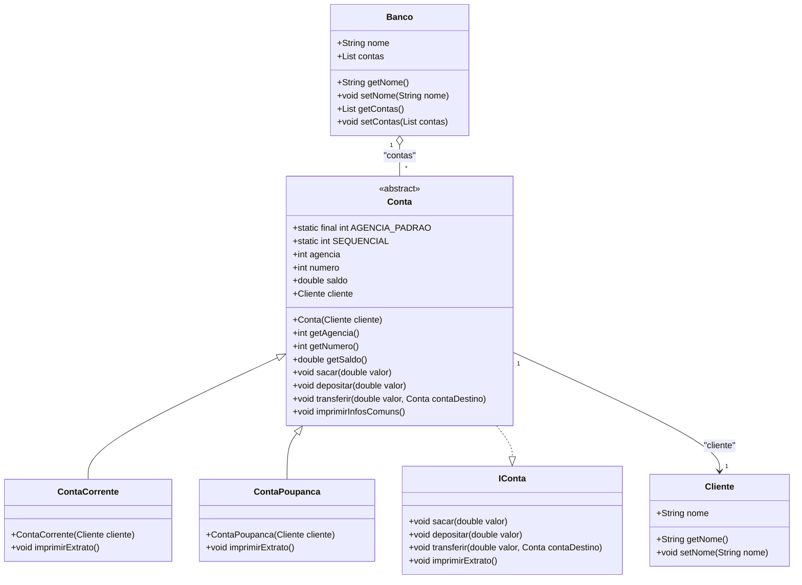

# Desafio banco DIO

```mermaid
classDiagram
    class Banco {
        +String nome
        +List<Conta> contas
        +String getNome()
        +void setNome(String nome)
        +List<Conta> getContas()
        +void setContas(List<Conta> contas)
    }

    class Cliente {
        +String nome
        +String getNome()
        +void setNome(String nome)
    }

    class IConta {
        +void sacar(double valor)
        +void depositar(double valor)
        +void transferir(double valor, Conta contaDestino)
        +void imprimirExtrato()
    }

    class Conta {
        <<abstract>>
        +static final int AGENCIA_PADRAO
        +static int SEQUENCIAL
        +int agencia
        +int numero
        +double saldo
        +Cliente cliente
        +Conta(Cliente cliente)
        +int getAgencia()
        +int getNumero()
        +double getSaldo()
        +void sacar(double valor)
        +void depositar(double valor)
        +void transferir(double valor, Conta contaDestino)
        +void imprimirInfosComuns()
    }

    class ContaCorrente {
        +ContaCorrente(Cliente cliente)
        +void imprimirExtrato()
    }

    class ContaPoupanca {
        +ContaPoupanca(Cliente cliente)
        +void imprimirExtrato()
    }

    Banco "1" o-- "*" Conta : "contas"
    Conta <|-- ContaCorrente
    Conta <|-- ContaPoupanca
    Conta ..|> IConta
    Conta "1" --> "1" Cliente : "cliente"

```
